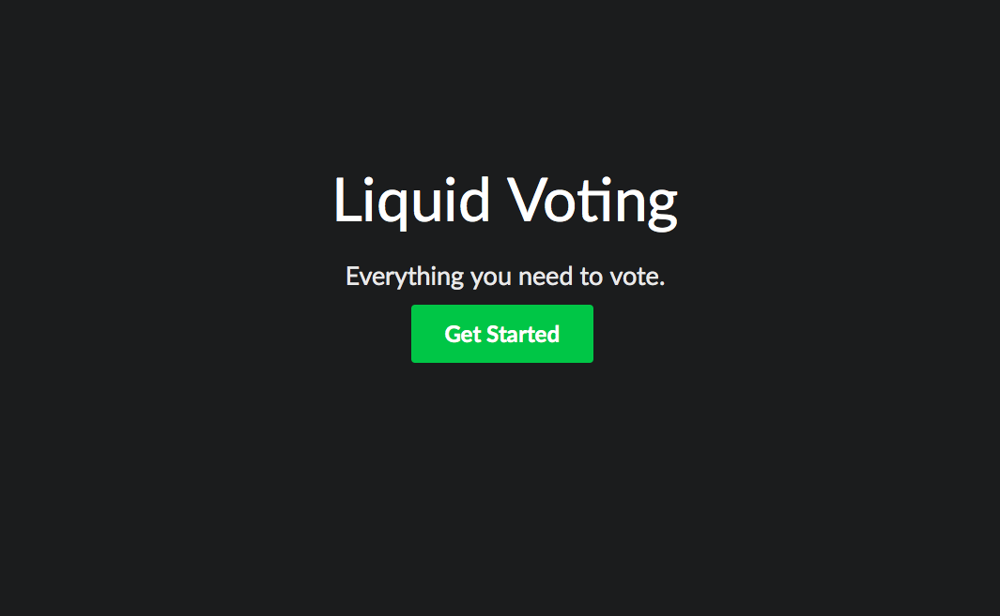
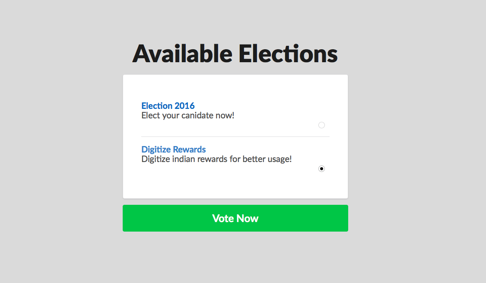
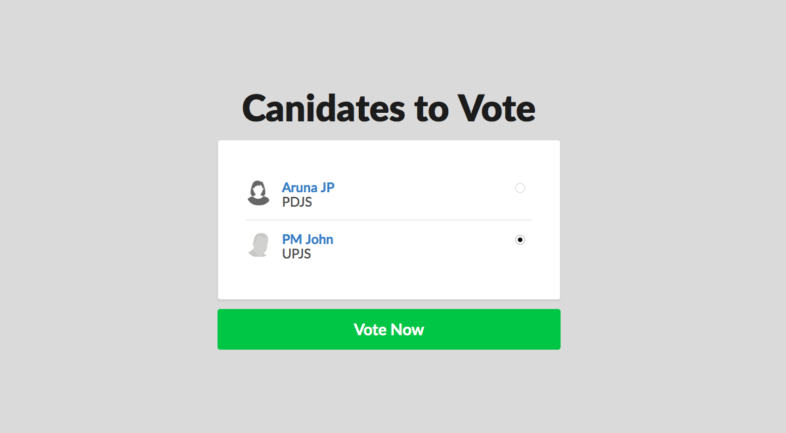

# Liquid Voting

> *Liquid Voting* is a blockchain based voting/decision making platform made for [hack4people](http://hack4people.com) Hackathon by team [lightrains](https://lightrains.com). ( [niksmac](https://github.com/niksmac), [kp666](https://github.com/kp666) & [sibizulu](https://github.com/sibizulu) )

Corruption exist because of concentrating of power. Our solution brings that power to the masses. This is brought by the power of decentralization on top of a tamper proof public blockchain. The voting platform is so powerful that it can pave the path to liquid democracy. The real impact is when we use the platform for day to day decision making in government activities.

## Inspiration
> “A vote is like a rifle: its usefulness depends upon the character of the user.” - Theodore Roosevelt

## Intentions

* Improve Transparency in Voting
* Reduce security risk
* Reduce cost of running an election
* Act as a platform to vote on decisions.

## Outcome

* Built on top of Blockchain
* Elections are secured by Smart Contracts
* Cost of infrastructure will be very less (~0.5%)

## Screenshots

